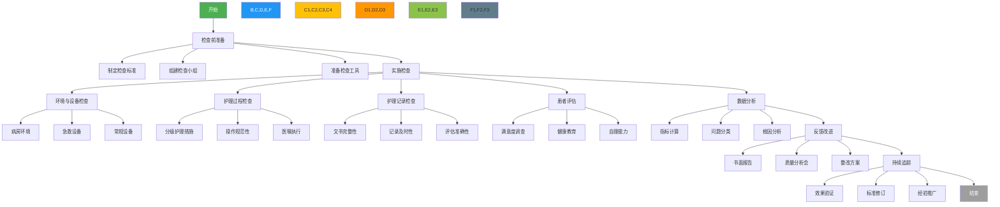

以下是护理质量检查的标准化流程图（Mermaid语法）：



**流程图说明**：
1. **颜色编码**：
   - 绿色：开始/结束节点
   - 蓝色：主要流程阶段
   - 黄色：现场检查环节
   - 橙色：数据分析环节
   - 浅绿：反馈环节
   - 深灰：追踪环节

2. **关键路径**：
   ```mermaid
   graph LR
   A[准备阶段] --> B[现场检查] --> C[数据分析] --> D[反馈改进] --> E[持续追踪]
   ```

3. **扩展建议**：
- 如需更详细的子流程，可在各检查环节（如C21分级护理措施）下继续展开
- 可添加决策节点（菱形符号）表示不合格项目的处理路径
- 可增加时间标注显示各环节建议耗时
