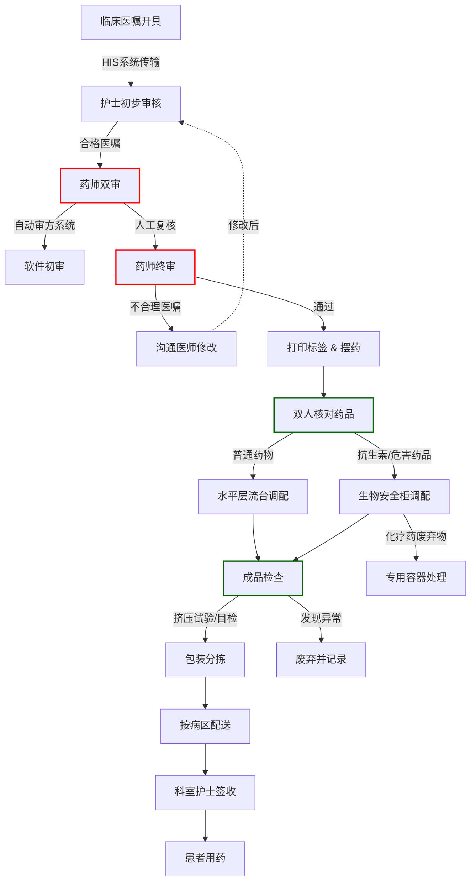
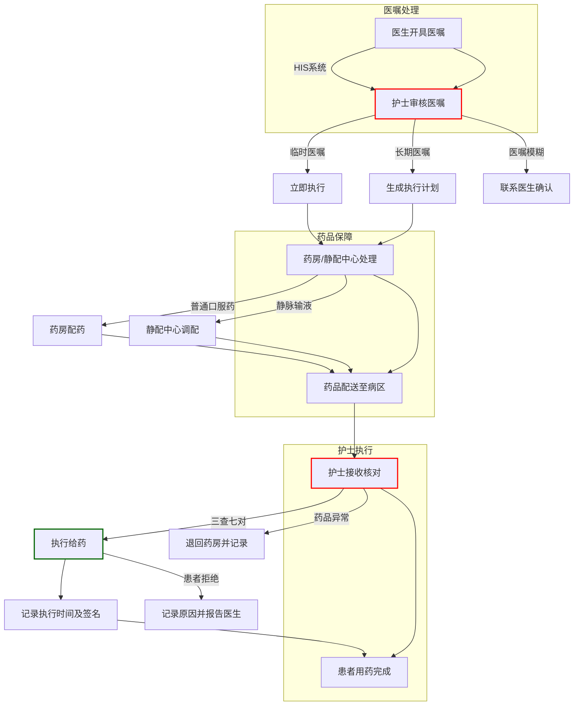
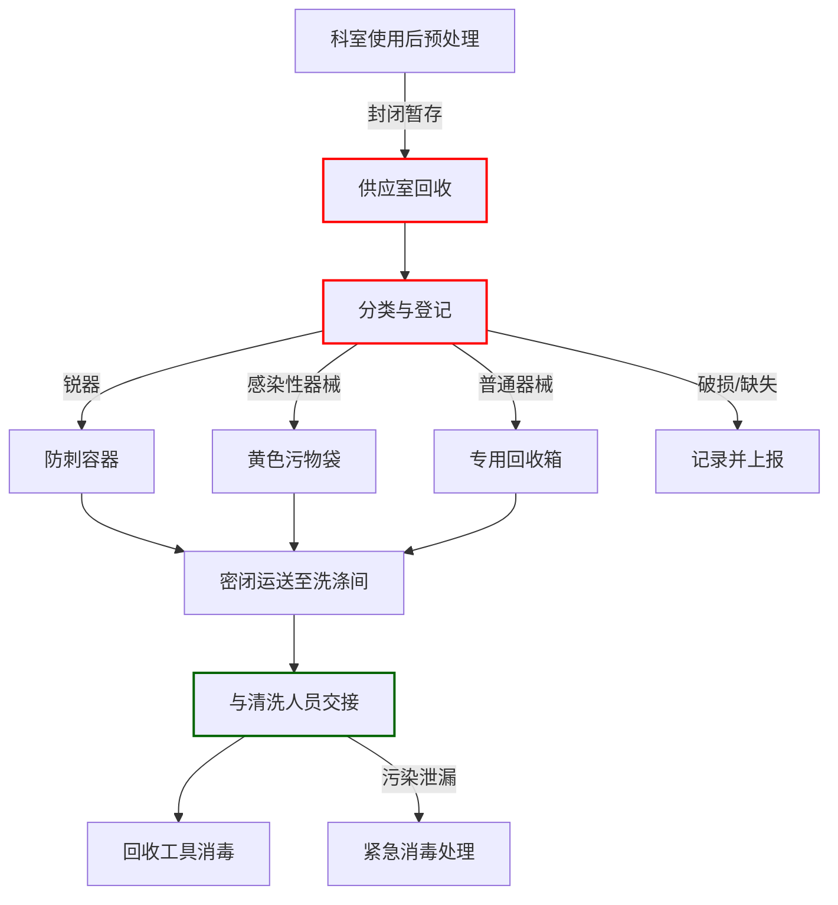
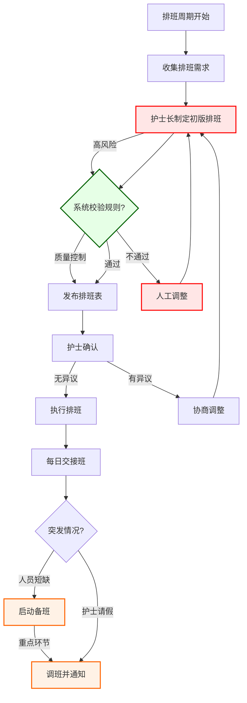
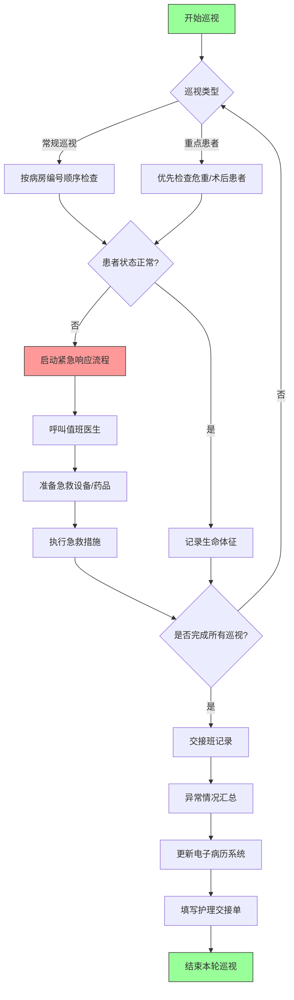

# 医院静配中心（PIVAS）业务流程图

以下是使用 **Mermaid** 语法绘制的医院静配中心（PIVAS）业务流程图，包含核心环节和关键控制点：



---

### **流程图说明**：
1. **红色节点**（药师双审、人工终审）为 **高风险控制点**，需严格把关。
2. **绿色节点**（双人核对、成品检查）为 **质量核查环节**。
3. **特殊分支**：
   - 不合理医嘱需退回修改（红色虚线）。
   - 危害药品废弃物单独处理（紫色箭头）。
4. **合规要求**：
   - 抗生素与普通药物分台调配。
   - 所有成品需通过渗漏和沉淀检查。

---

### **使用提示**：
1. 复制代码至支持 Mermaid 的编辑器（如 Typora、VS Code 插件或在线工具）。
2. 如需调整布局，可修改 `flowchart TD` 为 `LR`（横向流程图）。
3. 添加更多细节（如时间要求）可在节点后用 `%%` 注释说明。

------


#  **医嘱 → 护士执行完毕**


以下是医院 **医嘱 → 护士执行完毕** 的完整业务流程图（Mermaid 代码），涵盖 **HIS系统流转、药房/静配中心协作、护士执行核对** 等关键环节：



---

### **流程图解析**  
1. **医嘱分类处理**  
   - **临时医嘱**（如一次注射）：需护士立即审核并执行。  
   - **长期医嘱**（如每日输液）：生成执行计划，按批次处理（如静配中心分批次配送）。  

2. **药品保障路径**  
   - 口服药由药房配发，静脉用药由静配中心无菌调配，均需 **双人核对** 后配送。  

3. **护士执行核心**  
   - **三查七对**：查药品有效期、配伍禁忌，核对患者姓名、床号、药名、剂量、时间、途径、浓度。  
   - **异常处理**：药品问题立即退回，患者拒绝需记录原因。  

4. **关键控制点**  
   - 红色节点（护士审核、接收核对）为 **高风险环节**，绿色节点（执行给药）需 **严格操作规范**。  

---

### **异常场景说明**  
- **医嘱模糊**：护士需暂停执行，联系医生书面确认。  
- **药品配送延迟**：启动应急预案（如优先调配急救药品）。  
- **执行记录缺失**：系统自动拦截未签名医嘱，防止遗漏。  

---

### **使用提示**  
1. 横向流程图：将 `TD` 改为 `LR`，适合展示时间线。  
2. 扩展静配中心细节：可嵌入子流程（参见上一篇静配中心流程图）。  
3. 合规依据：流程符合《医嘱制度》和《临床用药安全管理制度》。  

如果需要更详细的 **药房/静配中心内部流程** 或 **电子医嘱系统逻辑**，可进一步拆分子模块！


----


# 器械回收流程图


以下是医院供应室器械回收的标准流程图（基于国家规范及操作指南整理），包含关键环节、操作细节及质量控制要点：

---

### **一、器械回收流程图（Mermaid代码）**


---

### **二、关键环节说明**
1. **科室预处理**  
   - 使用后器械需立即清除明显污物，避免污物干涸，并封闭暂存。  
   - 一次性用品和医疗废物不得混入回收流程。

2. **供应室回收**  
   - **防护要求**：工作人员需穿戴帽子、口罩、手套，必要时穿防水围裙。  
   - **回收工具**：使用专用封闭式回收车或箱，避免污染扩散。  
   - **时效性**：定时按指定路线回收，禁止在污染区清点器械。

3. **分类与登记**  
   - **分类标准**：  
     - 锐器（如针头、刀片）放入防刺容器；  
     - 感染性器械（如被血液污染的敷料）投入黄色污物袋；  
     - 普通器械按材质（金属/塑料）分类。  
   - **追溯记录**：登记器械名称、数量、来源科室及回收时间。

4. **交接与消毒**  
   - 与清洗人员交接时核对数量，避免口头清点。  
   - 回收车/箱每次使用后需用含氯消毒剂擦拭，干燥存放。

---

### **三、质量控制要点**
1. **防护合规性**  
   - 高风险操作（如感染性器械处理）需升级防护（护目镜、隔离衣）。  
2. **污染控制**  
   - 回收工具不得跨区使用（污染区/清洁区分开）。  
3. **特殊器械处理**  
   - 精密器械（如内窥镜）需单独放置，避免碰撞。  
4. **记录追溯**  
   - 使用扫码系统或纸质记录确保全程可追溯。  

---

### **四、异常处理流程**
- **器械破损/缺失**：立即停止回收，记录并上报质控部门。  
- **污染泄漏**：用含氯消毒剂（如1000mg/L）喷洒污染区域，30分钟后清理。  

---

### **五、相关规范依据**
- 《消毒供应中心管理规范》  
- 目视流程图在消毒供应室的应用（提升操作合规性）  

如需更详细的清洗/灭菌流程，可参考上述规范或补充提问。


# 医院住院护士站排班管理

以下是医院住院护士站排班管理的标准流程图（基于医院人力资源管理和护理部规范），包含排班制定、调整、交接班等核心环节，使用Mermaid代码绘制：

---

### **一、护士站排班管理流程图（Mermaid代码）**
```mermaid
flowchart TD
```



### **二、关键环节说明**
1. **排班需求收集**  
   - 护士提交休假/特殊需求（如夜班回避、培训时间）。  
   - 科室需求：根据患者数量、手术安排等确定各时段人力配置。  

2. **排班规则校验**  
   - **系统自动检测**：  
     - 连续工作时间≤12小时；  
     - 两班间隔≥12小时；  
     - 法定节假日轮换公平性。  
   - **人工复核**：确保高年资与低年资护士合理搭配。  

3. **排班发布与确认**  
   - 通过护理管理系统或公示栏发布，护士需在24小时内确认。  
   - 争议处理：护士长需在3个工作日内协调解决。  

4. **交接班与应急处理**  
   - **每日交接班**：明确当班护士职责（如分管床位、危重患者）。  
   - **突发情况**：  
     - 备班护士需在30分钟内到岗；  
     - 调班需护士长签字并更新系统记录。  

---

### **三、质量控制要点**
1. **合规性**  
   - 符合《劳动法》工时规定（月总工时≤166.64小时）。  
2. **公平性**  
   - 夜班/节假日轮换透明，优先满足护士合理需求。  
3. **应急响应**  
   - 备班护士名单需每周更新，确保联系方式畅通。  

---

### **四、异常处理流程**
- **排班冲突**：重新协商或上报护理部仲裁。  
- **系统故障**：启用纸质排班表，事后补录系统。  

---

### **五、相关支持系统**
- 护理排班管理系统  
- 移动端排班确认与通知功能  

如果需要更详细的 **交接班流程** 或 **排班规则逻辑**，可进一步扩展子流程！

# 病房巡视

以下是一个医院病房护士站巡视逻辑与规则的Mermaid流程图设计，包含常规巡视、紧急响应和记录流程：



### 流程说明：
1. **巡视类型判断**：
   - 常规巡视：按固定路线和频次（如q1h/q2h）
   - 重点巡视：术后/危重患者需增加频次（如q30min）

2. **异常处理路径**：
   - 红色标注的紧急响应流程（符合医疗RRT标准）
   - 包含呼叫支援、急救准备、执行干预措施

3. **记录系统**：
   - 双重记录机制（电子系统+纸质交接单）
   - 异常情况需重点标注

4. **质量控制**：
   - 每班次需完成所有病房覆盖
   - 使用PDA扫描患者腕带确认身份

### 扩展规则建议：
- 颜色标识系统：可用`style`定义不同优先级
- 时间控制：可添加`定时触发`节点（如`T>60min`触发提醒）
- 人员协作：可增加`双人核查`节点（针对高危操作）

需要补充特定医院的巡视标准或电子系统对接细节可以进一步调整。