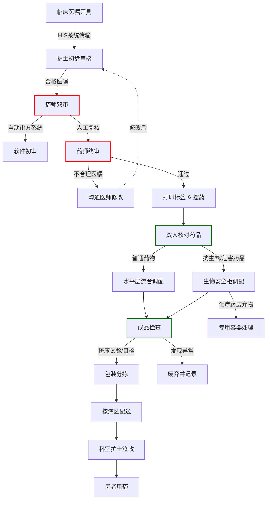
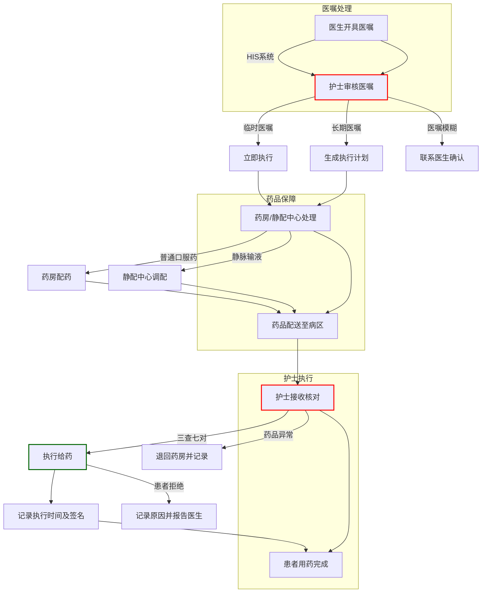
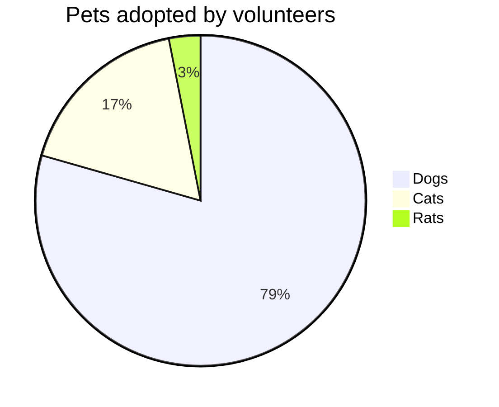
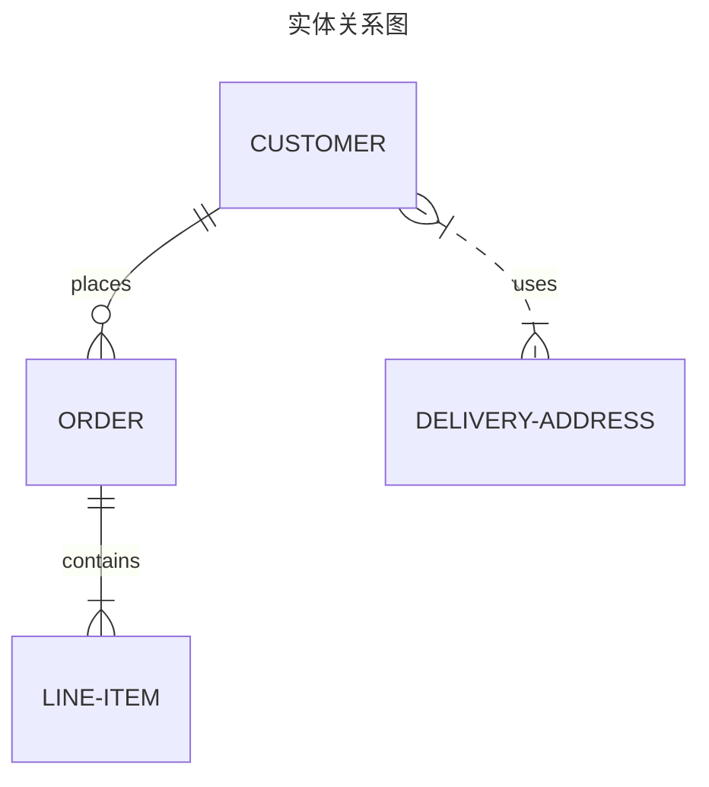
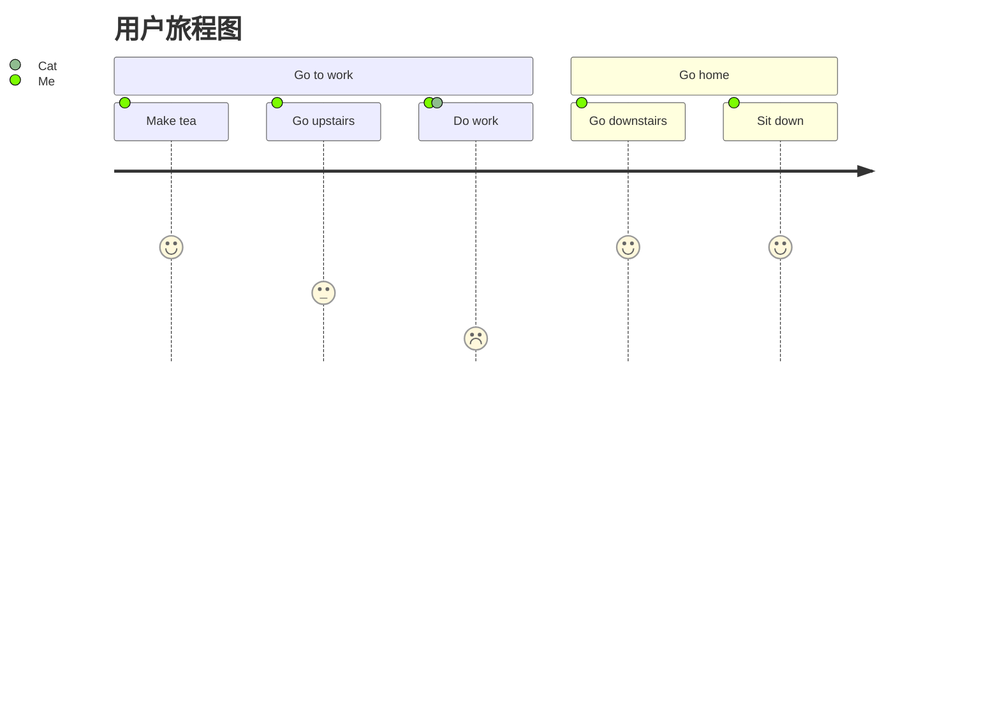
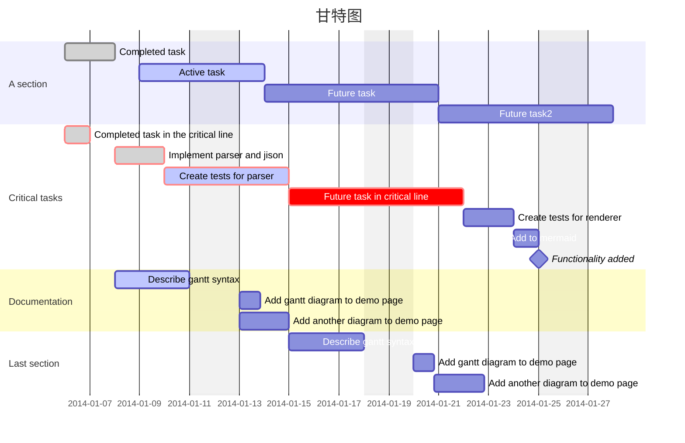
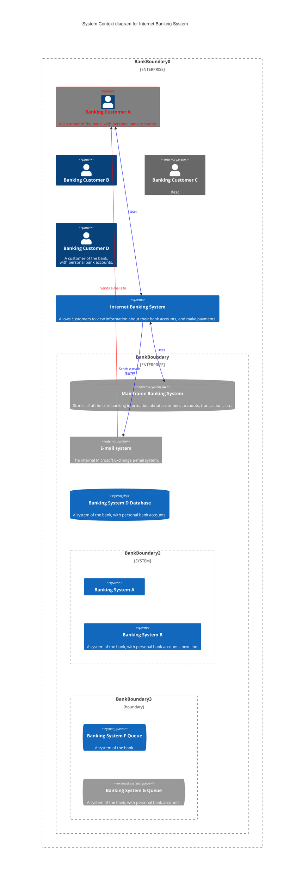
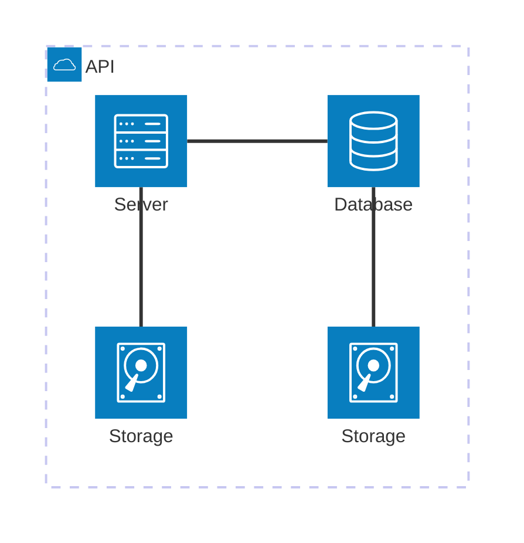
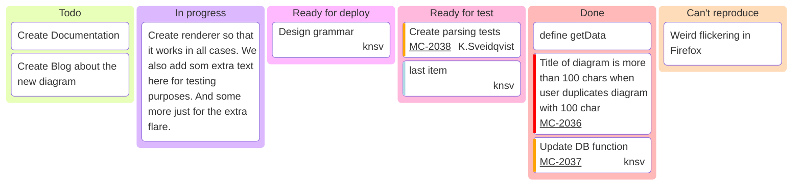

# [Mermaid  中文网](https://mermaid.nodejs.cn/config/usage.html)



















```typescript
// ArkUI主框架中嵌入Flutter WebView
import webview from '@ohos.web.webview';

@Entry
@Component
struct MainPage {
  controller: webview.WebviewController = new webview.WebviewController();
  
  build() {
    Column() {
      Web({ 
        src: 'flutter_module/index.html',
        controller: this.controller 
      })
    }
  }
}
```




```mermaid
 
```